# Yuan Hsiang Cheng
__JavaScript Developer__ lyforever62@hotmail.com (+886) 987-844-985
 

------

### Profile {#profile}

> A dedicated professional with 5+ years in Node.js development. Specializes in front-end architecture and web development. Be familiar with modern frontend knowledge and be devoted to advanced technology.
 

------

### Skills {#skills}

* Front-end Development
  : Contributed to full-stack web development projects, with an emphasis on front-end architecture. Focus on React Native and React Native Web recently.

* Backend Development
  : Worked on API, GraphQL and authentication implementation with MySQL, PostgreSQL, MongoDB.
 

-------

### Technical {#technical}

1. JavaScript (ES6+, NodeJS, ReactJS)
1. React Native (Android, iOS)
1. GraphQL / API / GRPC
1. Git
1. Golang /ReasonML / Python / Rails
1. MySQL / PostgreSQL / MongoDB
1. Linux / FreeBSD

------

### Experience {#experience}
--- ---
#### MaiCoin
*Software engineer __2018.05-present__*

  * Implement new features of hedging service by Golang. complete supporting market data from more than four crypto exchanges in two months and one private channel in one month.
  * Develop a cryptocurrency exchange app called MAX by React Native.
   
  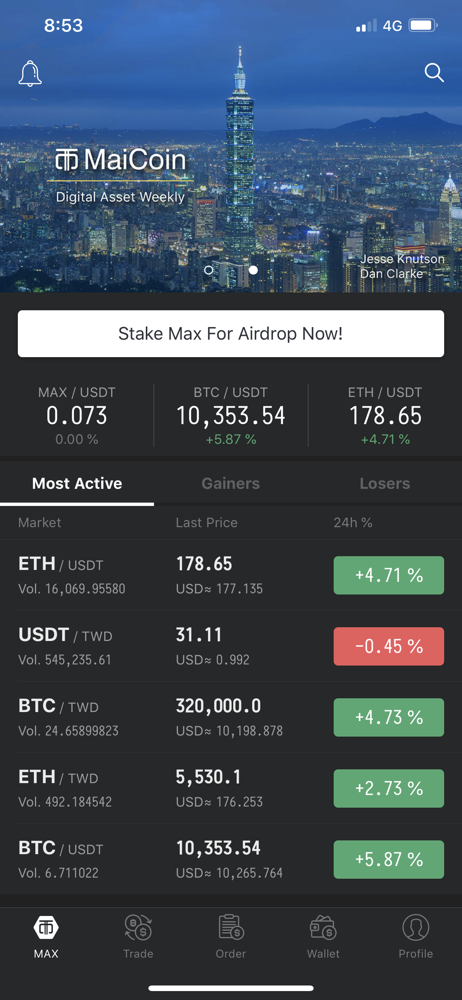
  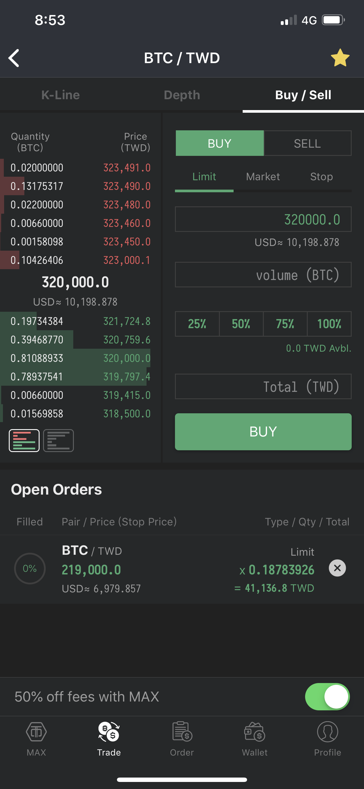
  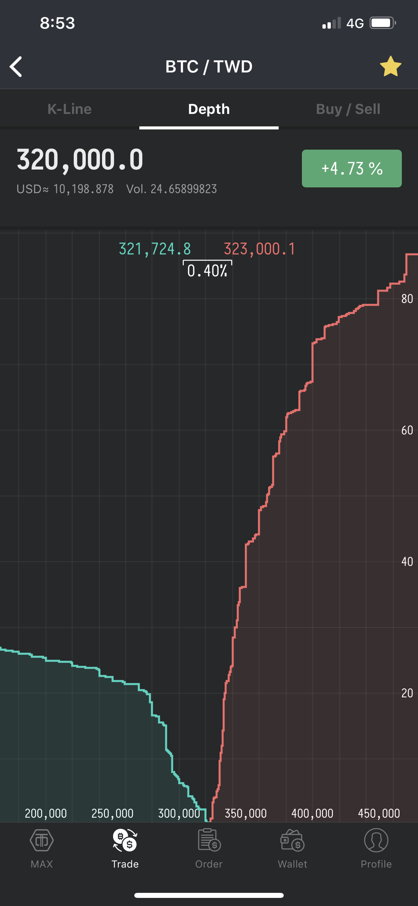
  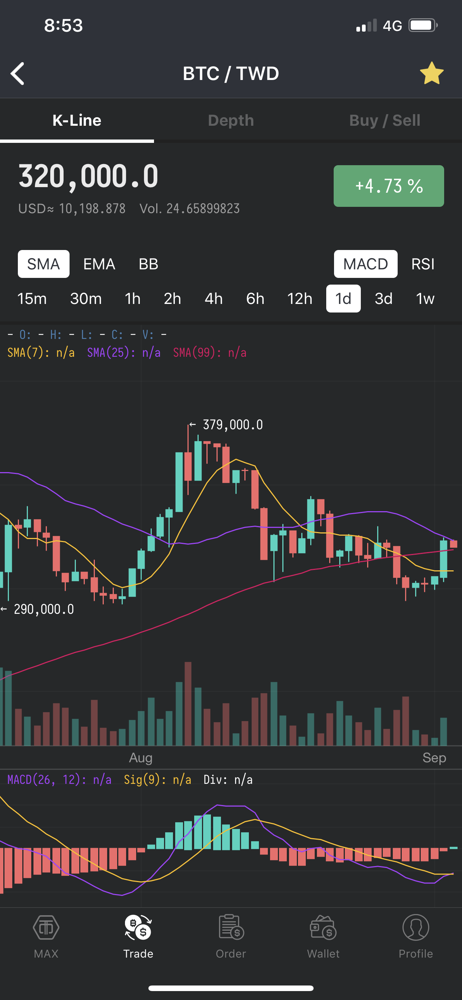
  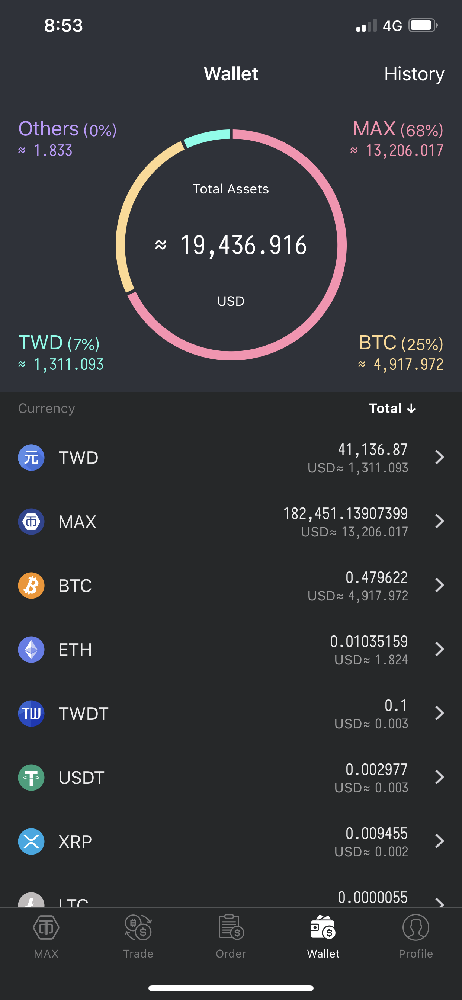
  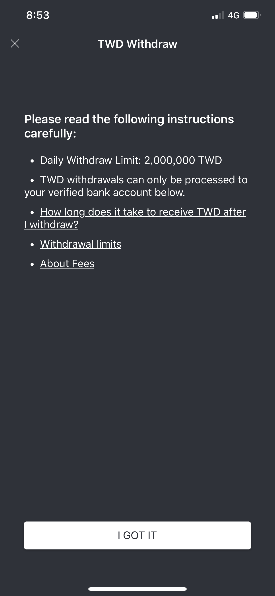
  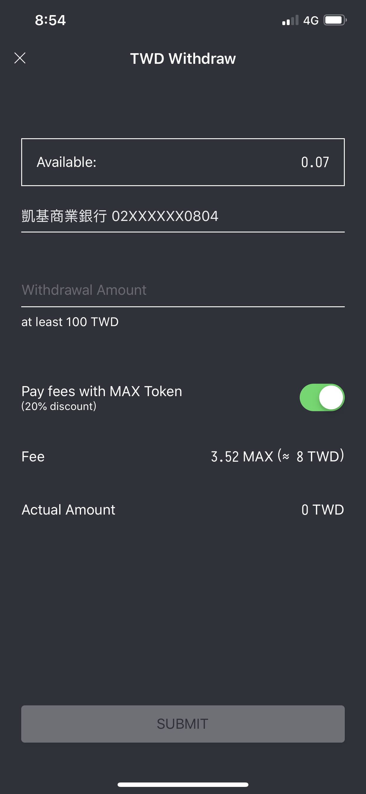
  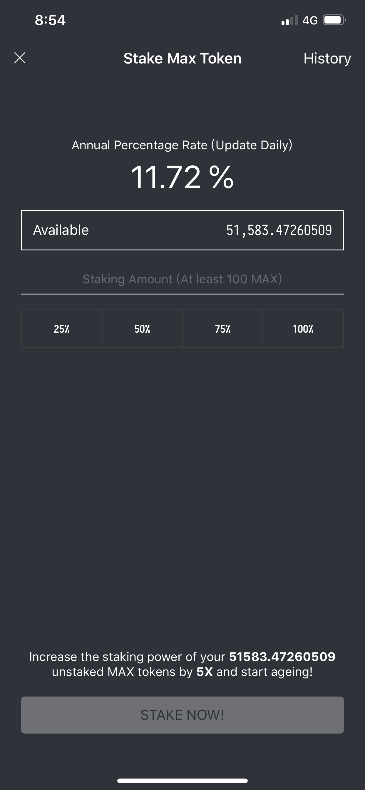
  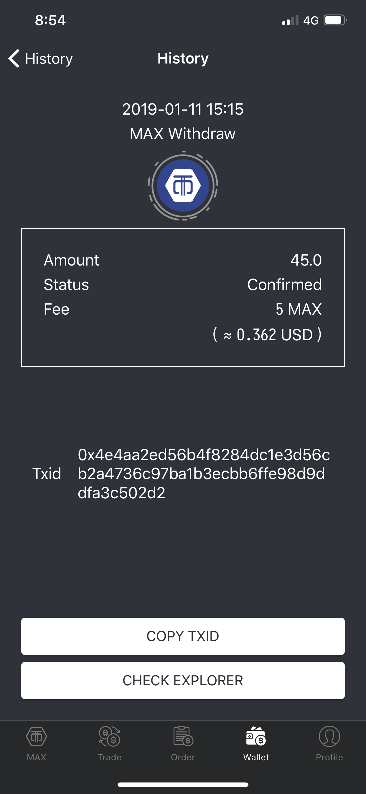
  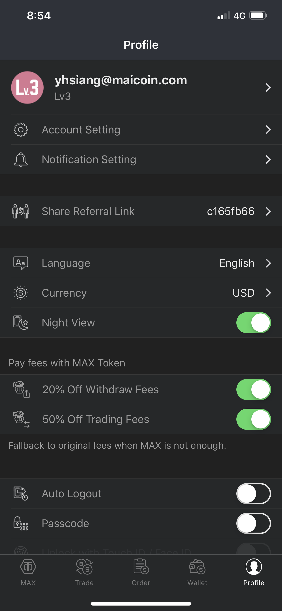
  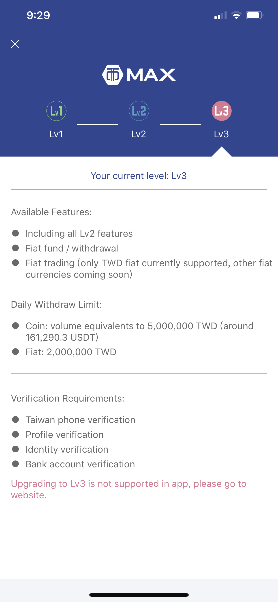
  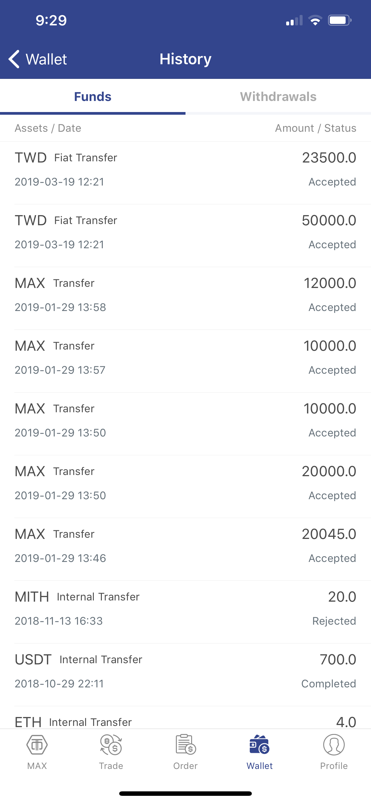
  
  * Build a graphql server for Maicoin app.
  * Introduce authentication and authorization with OIDC (OpenID Connect) to team.
  * Implement redesign trading page by React Native Web.
  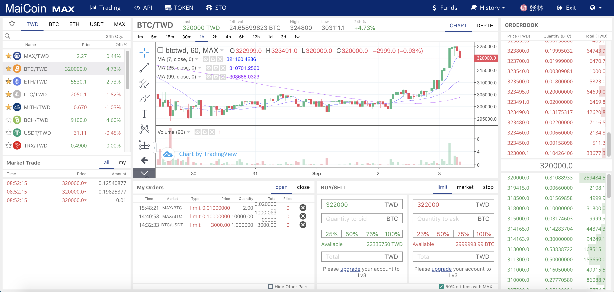
  * Maintain rails website.

------

#### Appier
*Frontend engineer __2015.08-2018.04__*

  * Develop internal dashboard for finance team and sales team.
  * Interview front-end engineers.
  * Mentor junior front-end engineers.
  * Build a single-sign on service for authentication and authorization with our microservice infrastructure.
  * Build automation scripts for improving HR's workflow.
  * Develop campaign dashboard which is our __mainly__ product on adversting.
  * Get the best individual sharing twice.
  * Introduce ReasonML to other front-end engineers.
 

------

#### Watchout Co.
*Software developer __2014.06-2015.07__*

  * Improve the front-end development process, and transform ideas to the real application.
  * Legislative Yuan transcripts platform (http://sayit.musou.tw/).
  * Automatically stream live broadcast of Legislative Yuan to youtube. (https://github.com/yhsiang/auto-stream-to-youtube-example)
  * OAuth2 provider implementation by Node.js for membership system.
 
 

------

#### Ubuntu Life Co.
*Web developer __2013.05-2014.06__*

  * Develop web dashboard for IOT devices.
  * Use Angularjs for front-end.
  * Use NodeJS and MySQL for backend.
 
 

------

#### Recruitment Center of National Armed Forces
*Mandatory military service __2011.11-2012.10__*

  * Maintain Windows servers and network equipment like hardware firewall. 
  * Automatic daily and weekly works by batch files. 
  * Work with outsourcers.
 
 

------

#### Computer Center of National Chiao Tung University Computer Science Department
*Contractor __2008.08-2009.07__*

  * FreeBSD / Linux and PHP experiences.
  * Maintain NCTUCS web service.
  * Maintain BS2 web blog.
 
 

------

### Volunteering {#volunteering}

#### g0v.tw (Open source community)
*Evangelist and contributor __2013.06-present__*

  * A heavy contributor in many projects, mostly works in the front-end part.
  * g0v summit 2016 international conference coordinator
  * vTaiwan: Consultation and e-Rulemaking (http://vtaiwan.tw)
  * Legislative Yuan web redesign project (http://ly.g0v.tw)

------

### Talks {#talks}

* Sayit in Taiwan @ __COSCUP 2015__

  https://speakerdeck.com/yhsiang/sayit-in-taiwan

* Webpack pack your web @ __Modernweb 2015__

  https://speakerdeck.com/yhsiang/webpack-pack-your-web

* Experience in building isomorphic app @ __ReactJS Meetup__

  https://speakerdeck.com/yhsiang/experience-in-building-isomorphic-app

------

### Awards {#awards}

* Yahoo Hack Taiwan 2013 Special Award

------

### Footer {#footer}

Yuanhsiang Cheng -- lyforever62@hotmail.com -- (+886) 987-844-985

------